# Theo – UI Architecture (RADIO Format)

---

## R – Requirements

### Functional Requirements

| Priority | Requirement |
|---|---|
| P0 | Time contractions (start/stop) with live elapsed display |
| P0 | Show time since last contraction between recordings |
| P0 | Evaluate contraction patterns against 5-1-1 / 4-1-1 / 3-1-1 alert rules |
| P0 | Persist all data offline-first (no login required) |
| P1 | Archive current contractions into a named session; start fresh |
| P1 | View and edit individual contraction details (time, duration, intensity) |
| P1 | Rate contraction intensity (1–50 scale) |
| P1 | View past sessions with statistics |
| P1 | Notify user (push + haptic) when alert threshold is met |
| P2 | Share live contractions with a partner in real-time (Supabase sync) |
| P2 | Generate a read-only share link for midwife / care team |
| P2 | Mini-games (DinoGame, BubbleGame) + fun facts for distraction |
| P2 | Export contraction history as CSV |
| P3 | Dark / light theme toggle |
| P3 | Undo deleted contractions and sessions (5-second window) |

### Non-Functional Requirements

- **Offline-first** – core timing and local history works with no internet
- **Low latency input** – start/stop button must respond instantly; no async on the critical path
- **Real-time sync** – partner sees new contractions within ~1 second via Supabase Realtime
- **Crash resilience** – Skia canvas failures (DinoGame/BubbleGame) must not crash the app
- **Battery-friendly** – polling avoided; Realtime subscriptions + foreground-refresh only

---

## A – Architecture

### High-Level Layer Diagram

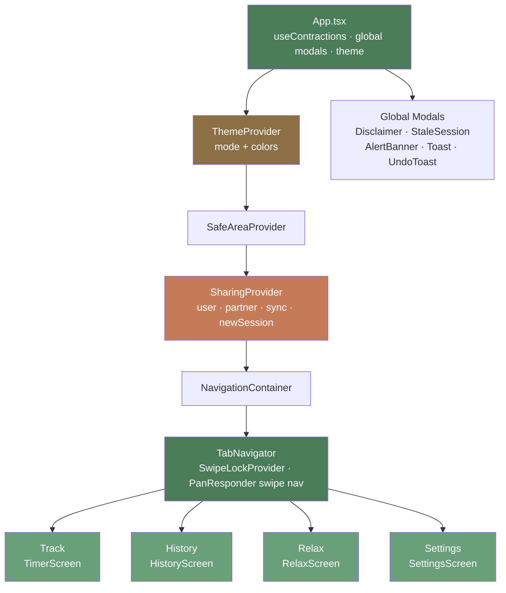

### Context & Provider Tree

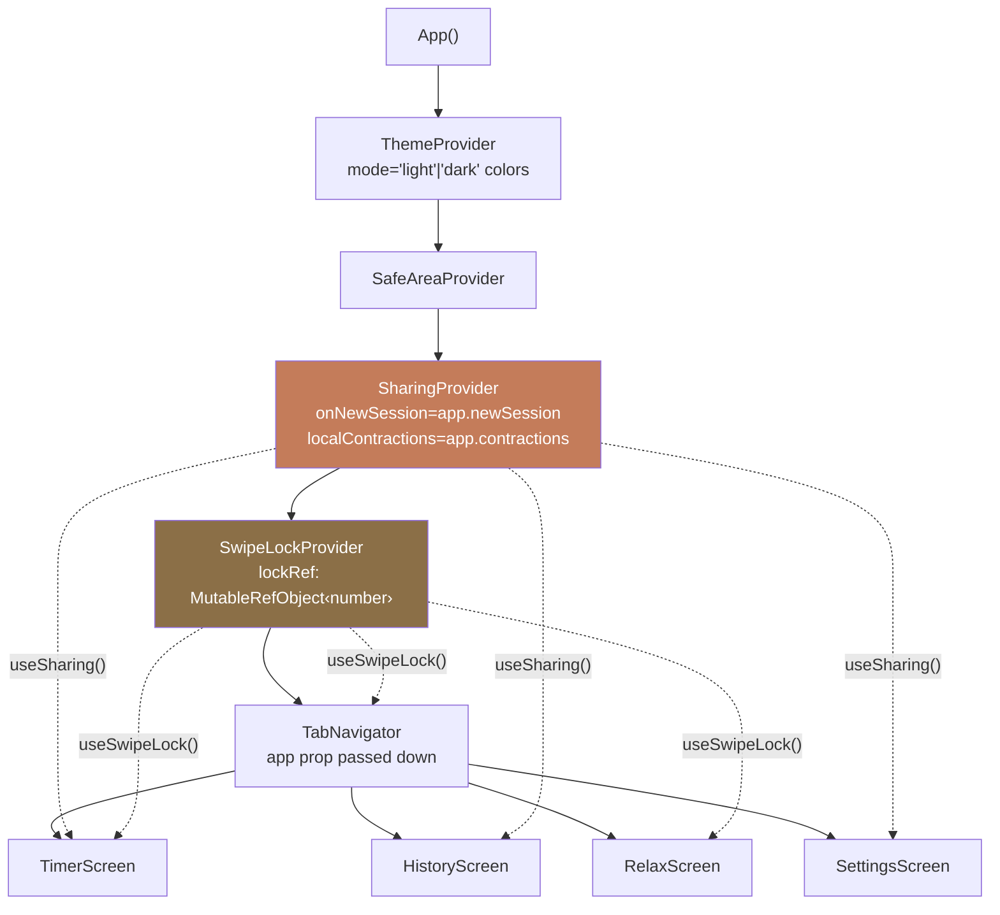

### State Ownership

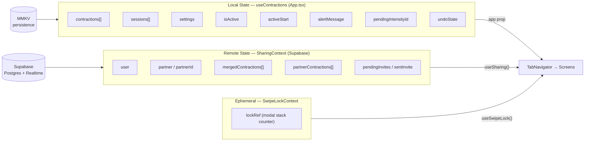

### Component Hierarchy

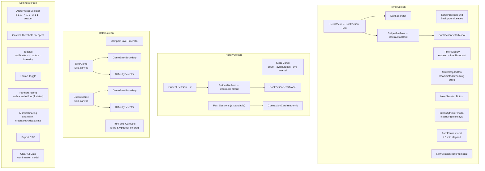

### Contraction Lifecycle (State Machine)

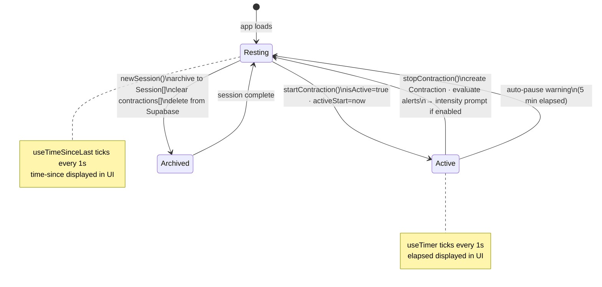

### Partner Sync Flow

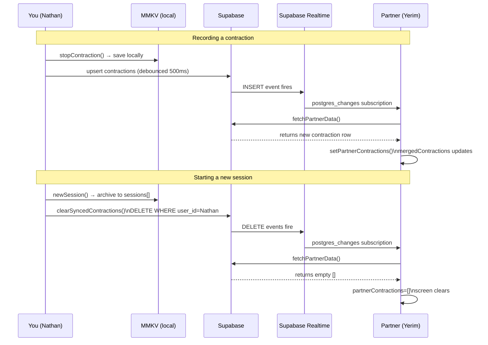

### Partnership Invite Flow

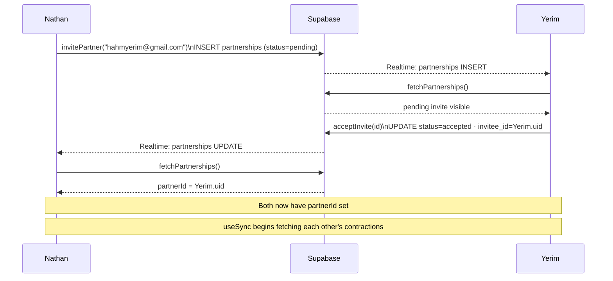

---

## D – Data Model

### Local Storage (MMKV)

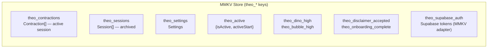

### Remote Schema (Supabase)

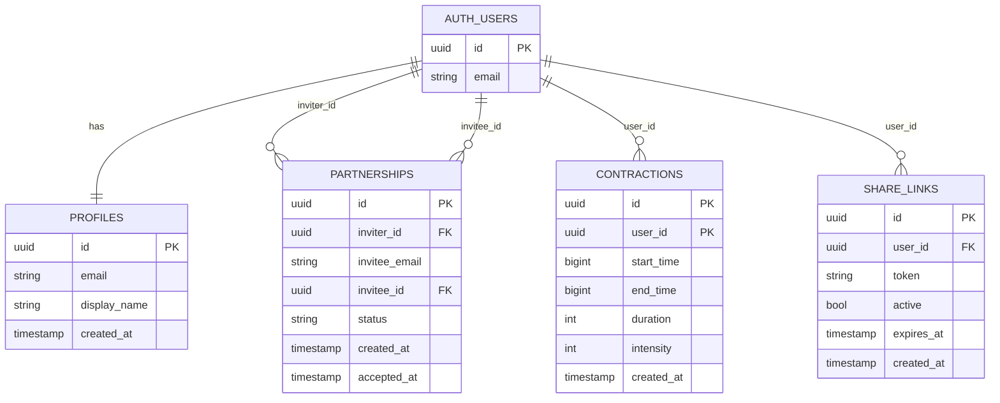

### RLS Policy Logic

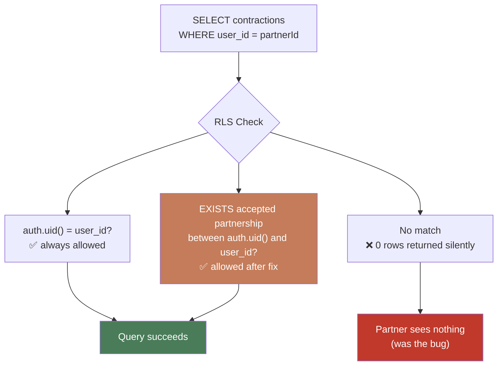

---

## I – Interface (Component & Hook APIs)

### Hook Dependency Graph

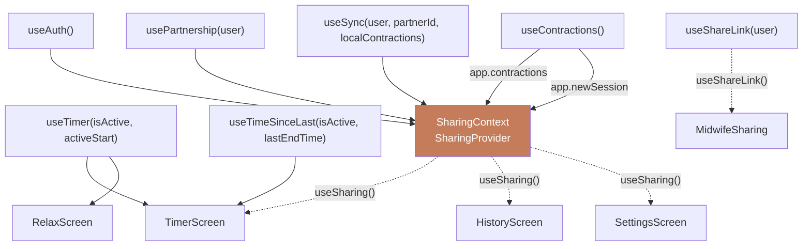

### `useContractions()` State Machine

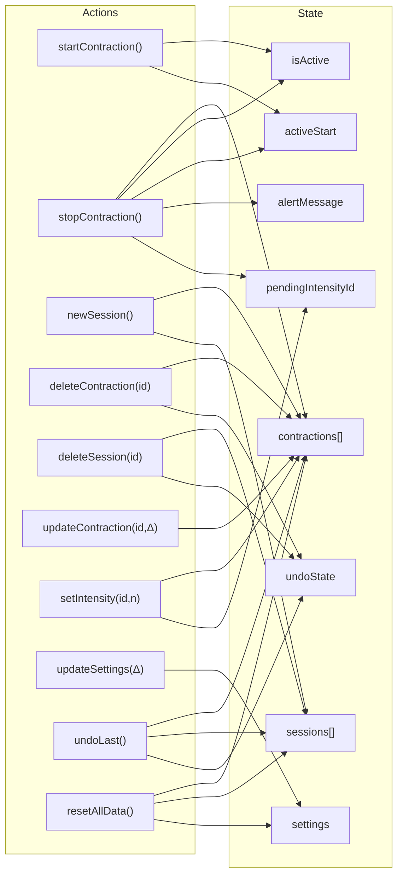

### Supabase Realtime Subscriptions

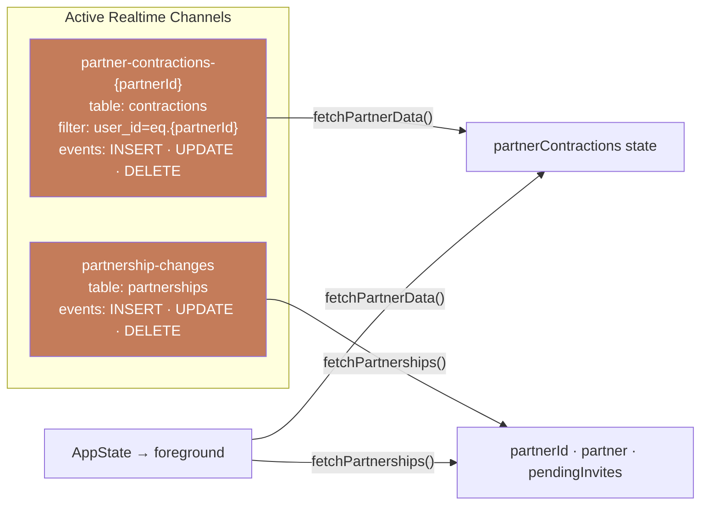

---

## O – Optimizations

### Performance

| Technique | Where | Why |
|---|---|---|
| MMKV storage | All persistence | 10× faster than AsyncStorage; synchronous reads on mount |
| Debounced upsert (500ms) | useSync | Batches rapid contraction updates into one Supabase write |
| Fingerprint check | useSync | Skips redundant upserts when contraction list hasn't changed |
| `useMemo` on mergedContractions | SharingContext | Prevents re-sort on every render; only re-runs when inputs change |
| Reanimated 4 (UI thread) | Breathing button, leaf BG | Animations run on native thread; won't block JS during timer |
| Skia canvas | DinoGame, BubbleGame | GPU-accelerated 2D; `GameErrorBoundary` prevents crash propagation |
| `useRef` for mountedRef | useSync | Prevents setState after unmount |
| Composite PK `(id, user_id)` | contractions table | Matches upsert `onConflict` exactly; no separate unique index needed |

### UX

| Technique | Where | Why |
|---|---|---|
| Undo toast (5s) | Delete contraction/session | Forgives accidental swipe-deletes without a confirmation dialog |
| SwipeLock context | Modals + TabNavigator | Prevents swipe-to-navigate while a bottom-sheet/modal is open |
| Stale session prompt | App.tsx | Auto-detects 24h gap and offers to start fresh — prevents stale data confusion |
| Pending intensity prompt | Post-stopContraction | Non-blocking: shows after stop so it doesn't interrupt timing flow |
| Partner read-only mode | ContractionDetailModal | Prevents editing partner's data while still surfacing detail |
| Auto-pause warning | TimerScreen | Alerts user if they forgot to stop a contraction after 5 min |
| 15-min alert cooldown | evaluateContractions | Prevents notification spam if threshold stays triggered |
| FunFacts swipe lock | RelaxScreen | Locks parent scroll + tab swipe during horizontal carousel interaction |

### Tradeoffs & Known Limitations

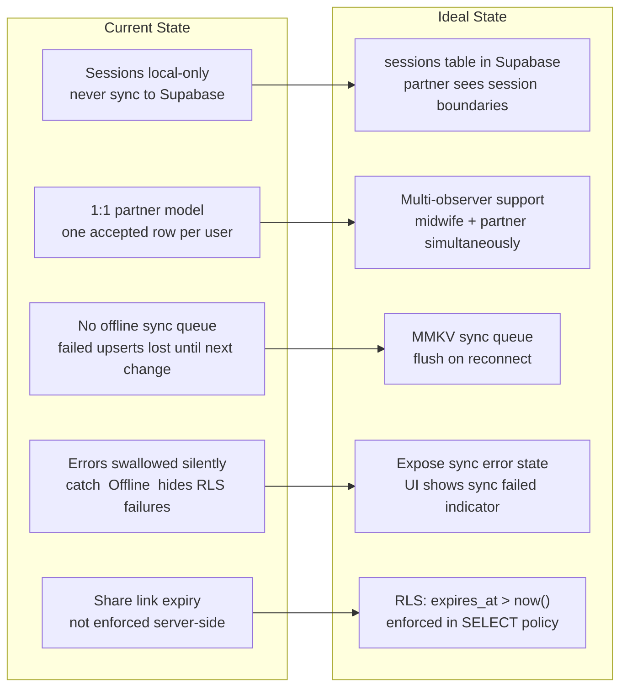
